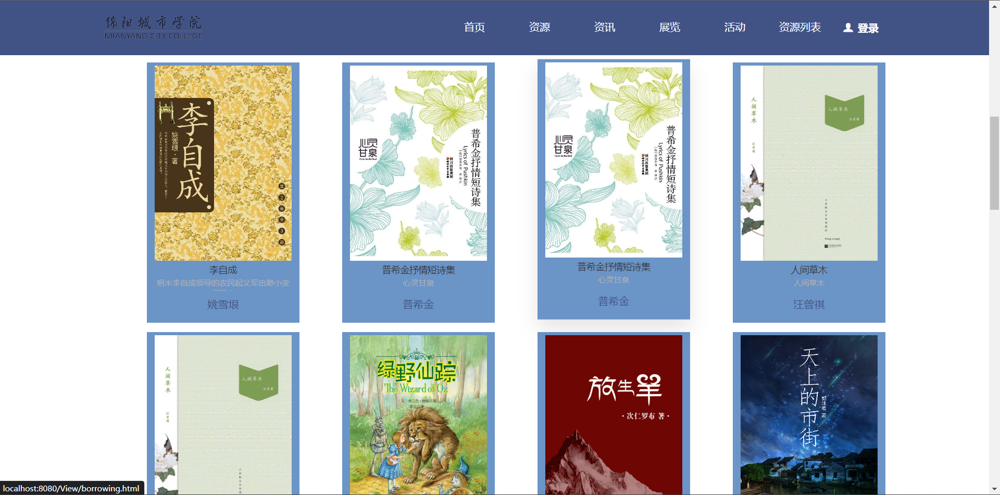
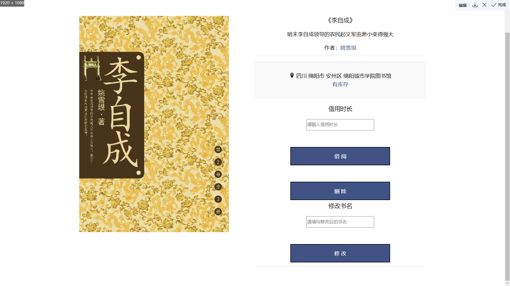

# LibraryManageSystem

## This is my final assignment  for my Web-Training class

### Here I used Maven + Servlet + Mybatis + Html + CSS + JavaScript + Swiper to complete this project

### Index_View:

### Book List_Page

###  Book Info_page

<<<<<<< HEAD

=======

>>>>>>> 415b647d891f6c2cc6252fcf15a1b6ab3f9bf9af
